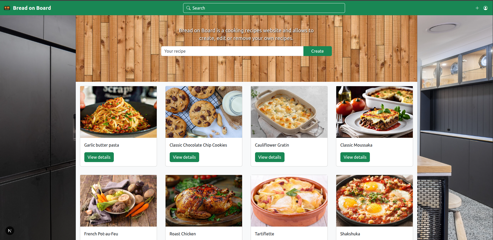
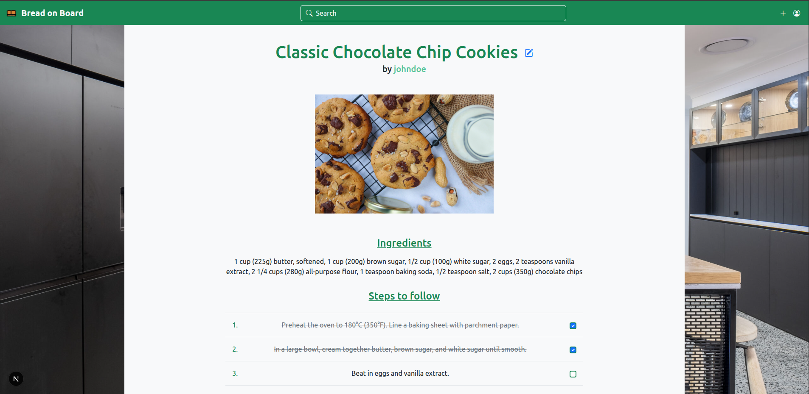

# Bread on Board

[](https://github.com/GimmyR/bread-on-board/actions/workflows/ci.yaml)

Bread on Board is a web application that lets users create, manage, and explore cooking recipes.

It is built with:

- **Next.js** for the frontend  
- **Spring Boot** for the backend API  
- **Oracle Database** for data persistence  
- **Docker** for containerized deployment

## Live Demo
- Frontend: https://bread-on-board.vercel.app/
- Backend & API: https://bread-on-board.onrender.com/
- API Documentation: https://bread-on-board.onrender.com/docs

> ℹ️ The backend is hosted on Render (free tier) and may experience a cold start.
> The first request can take up to ~30–60 seconds.






## Prerequisites

Before building or running the application, make sure you have the following installed :

* **Docker** 29.0.2
* **Docker Compose** 2.40.3

## Environment variables

```bash
# Database (Oracle)
DB_USER=SYSTEM
DB_PASSWORD=your_db_password

# Administrator account (created at startup)
ADMIN_USERNAME=admin
ADMIN_MAIL_ADDRESS=admin@example.com
ADMIN_PASSWORD=change_me

# Password hashing strength (bcrypt cost)
PASSWORD_STRENGTH=12

# JWT (HS512 requires at least 64 bytes)
JWT_SECRET=your_very_long_random_secret_key_here_at_least_64_bytes

# Frontend / CORS / API URLs
FRONTEND_URL=http://localhost:3000
NEXT_PUBLIC_CLIENT_SIDE_TO_API=http://localhost:8080
```

If you want to use a `.env` file, place it in the project's root directory.

iF you want to use **Supabase Storage S3**, you can add these environment variables in `.env` file and in `docker-compose.yaml` file :

```bash
# Supabase S3 endpoint
SUPABASE_S3_ENDPOINT=https://<project ID>.supabase.co/storage/v1/s3

# Supabase S3 access key
SUPABASE_S3_ACCESS_KEY=your_supabase_access_key

# Supabase S3 secret key
SUPABASE_S3_SECRET_KEY=your_supabase_secret_key

# Supabase S3 image URL
NEXT_PUBLIC_IMAGE_URL=https://<project ID>.supabase.co/storage/v1/object/public/<bucket name>
```

## Launch the application

Open a terminal in the project's root directory and run the following command :

```bash
docker compose --profile dev up --build
```

You can access the frontend application in your browser at http://localhost:3000.

The API documentation is available at http://localhost:8080/docs.

To sign in as an administrator for the backend, open http://localhost:8080 in your browser.

## License

This project is licensed under the MIT License - see the [LICENSE](./LICENSE) file for details.